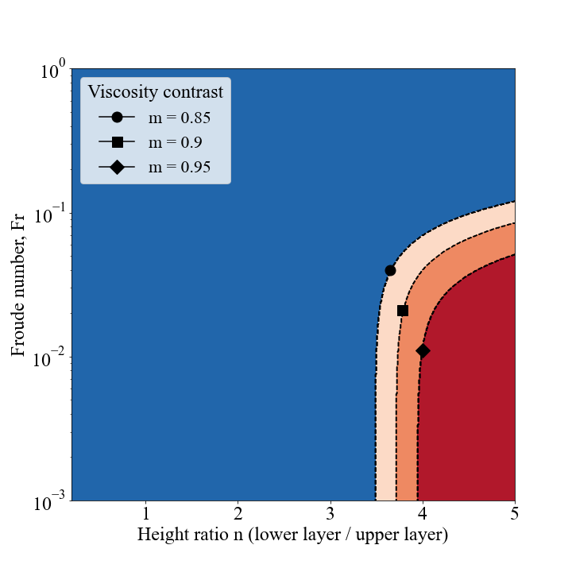

# Internal shear instability in layered lava flow may initiate the pahoehoe to ’a’a lava transition
---
This repository contains the scripts and notebooks used to run experiments and visualize the stability of a model lava flow under the free-surface and no-slip upper boundary conditions. The figures it produces are shown below and in the _Geophysical Research Letters_ submitted paper of the same name. 

### Paper Figures:

### Repo contents:
| Notebook              | Description                                                   |
|-----------------------|---------------------------------------------------------------|
| [free_surface_diagrams.ipynb](free_surface_diagrams.ipynb)  | Generates and creates plot for the Free Surface stability phase diagram. |
| [no_slip_diagrams.ipynb](no_slip_diagrams.ipynb)  | Generates and creates plot for the No Slip stability phase diagram. |
| [box_plots.ipynb](box+plots.ipynb)     | Runs the randomized box plot experiment that compares predicted solidified pahoehoe flow layer ratios to those observed in the field. |

| Script              | Description                                                   |
|-----------------------|---------------------------------------------------------------|
| [utils.py](utils.py)  | Contains the final stability equations converted to Python code from the matlab code in 'Free Slip LSA'.|

